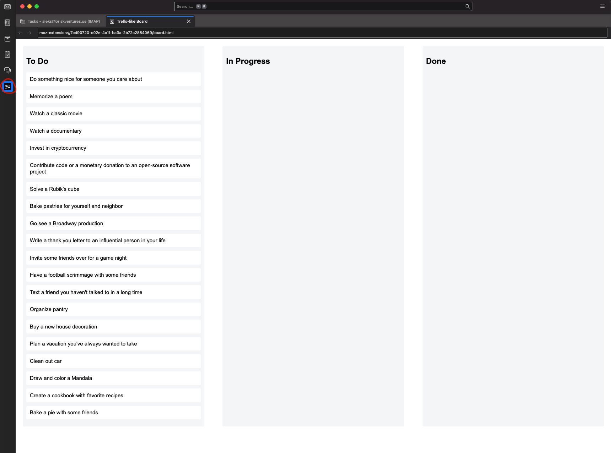
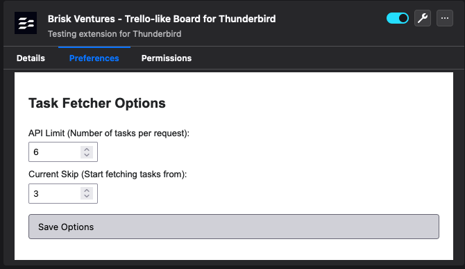
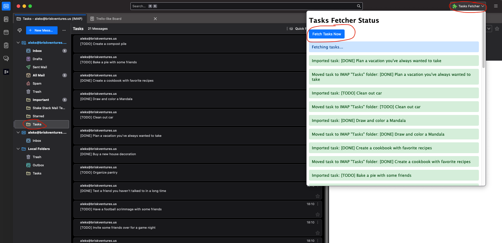

# Brisk Ventures - Trello-like Board for Thunderbird

**Version**: 1.0  
**Description**: A Thunderbird extension that adds a Trello-like board for managing tasks within Thunderbird. The board allows for drag-and-drop task management, along with task integration from an external API into Thunderbird’s local and IMAP folders.

## Features

- **Trello-like Task Board**: View and manage tasks directly within Thunderbird. Drag and drop tasks to reorder them.
- **Task Details**: Clicking on a task opens it in a browser for more detailed information (it opens briskventures.us for now as an example).
- **Task Syncing**: Fetch tasks from an external API, save them in Thunderbird’s local folder, and sync them to the IMAP folder.
- **Customizable API settings**: Edit how many tasks to fetch and from where.

## Screenshots

### Sidebar Trello-like Board

In the Thunderbird sidebar, we’ve added an icon that opens up a Trello-like task board. This board allows you to **drag and drop tasks** to reorder them as needed. Clicking on any task will open the task in a browser, providing more detailed information about that task.

### Extension Preferences

The extension comes with configurable preferences. Under the **Extension Options**, you can modify the API settings to specify how many tasks to fetch at a time (`take`) and how many tasks to skip (`skip`). This allows you to control the number of tasks that are fetched from the API and displayed on the board.

### Fetching Tasks Manually

To fetch tasks manually, you can use the extension’s feature to import messages from the API. The tasks are first imported into the **local "Tasks" folder** within Thunderbird and are then moved to the **IMAP folder** for further use. This keeps your tasks organized both locally and on the server.

## How to Use

1. **Open the Trello-like Board**: Click on the icon in the Thunderbird sidebar to open the Trello-like board. You can drag and drop tasks and click on them to view detailed information in your browser.
2. **Set Preferences**:
   - Go to **Preferences** -> **Add-ons and Extensions** -> **Brisk Ventures - Trello-like Board**.
   - Set the `skip` and `take` parameters to control how many tasks you fetch at a time from the API.
3. **Fetch Tasks Manually**:
   - The extension allows you to manually fetch tasks by pulling them from the API and importing them into Thunderbird’s local "Tasks" folder.
   - Once the tasks are in the local folder, they are automatically moved to the IMAP folder for access across devices.

## Installation

1. Download the `.zip` file for the extension (`test-extension.zip`).
2. Open Thunderbird, go to the **Add-ons and Themes** section, and click on **Install Add-on from File**.
3. Select the `.zip` file and follow the on-screen instructions.

## Development

- **Background Scripts**: The extension uses a background script to handle fetching tasks from the API, storing them in local folders, and syncing with IMAP folders.
- **Storage**: The extension stores preferences in `browser.storage.local` and uses Thunderbird’s APIs to manage messages and folders.

## Issues and Support

If you run into any issues, don’t worry — this is a test! Things might break, but hey, that’s part of the fun. No need to be upset if something’s not quite right, we’re just testing things out!
